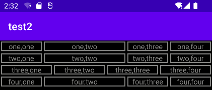

实验2_Android界面布局实验

 

<b>一&nbsp; 线性布局</b>

TextView1 2 4行&nbsp;权重1:2:1:1&nbsp;第3行权重为1:1:1:1

关键

①权重分布的实现

设置权重需要把 layout_width 设置成0后再设置权重layout_weight

②设置TextView边框

要实现TextView边框需要新建xml文件后设置shape

<pre style="background-color:#2b2b2b;color:#a9b7c6;font-family:'JetBrains Mono',monospace;font-size:9.8pt;">&lt;shape xmlns:android="http://schemas.android.com/apk/res/android"     android:shape="rectangle"&gt;     &lt;stroke         android:width="2dp"         android:color="@color/gray"&gt;     &lt;/stroke&gt; &lt;/shape&gt;</pre>

然后再在TextView中的background的引用已经设置的shape

<pre style="background-color:#2b2b2b;color:#a9b7c6;font-family:'JetBrains Mono',monospace;font-size:9.8pt;">android:background="@drawable/border"</pre>

 

 

 

 

 

 

 

 
